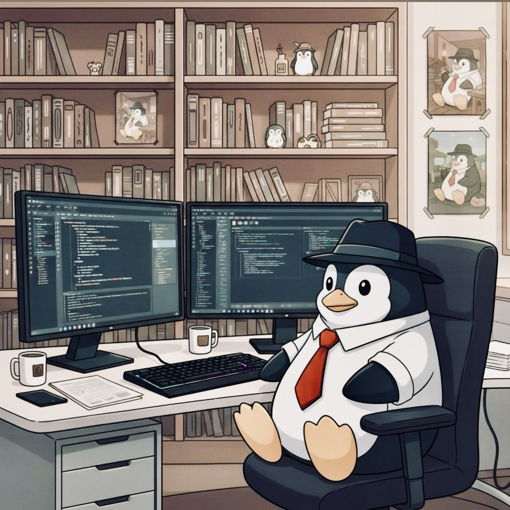

<table>
  <tr>
    <td width="40%" align="center">
      
    </td>
    <td width="60%" valign="middle">

      <!-- "Botão" de troca de idioma -->
      

        
        
      

      <h1>Isuke Felipe</h1>

      

        Desenvolvedor fullstack, game dev e entusiasta de infraestrutura Linux. 
        Building TRPGon, uma plataforma de VTT focada em TRPGs modernos.
      

    </td>
  </tr>
</table>

---

## Português

Oi! Sou o **Isuke**, desenvolvedor fullstack, game dev e entusiasta de infraestrutura Linux.  
Atualmente trabalho no TRPGon, uma plataforma de VTT focada em TRPGs modernos.

- 🔭 Projetos principais: TRPGon, ferramentas de automação com IA  
- 🐧 Stack favorita: Linux, Docker, Python, Node.js, Java, C#  
- 🎮 Interesses: game design, VTTs, 3D printing, automações para RPG de mesa  

## English

Hi! I'm **Isuke**, a fullstack developer, game dev, and Linux infrastructure enthusiast.  
I'm currently building TRPGon, a VTT platform focused on modern tabletop RPGs.

- 🔭 Main projects: TRPGon, AI-powered automation tools  
- 🐧 Favorite stack: Linux, Docker, Python, Node.js, Java, C#  
- 🎮 Interests: game design, VTTs, 3D printing, tabletop RPG tooling  
